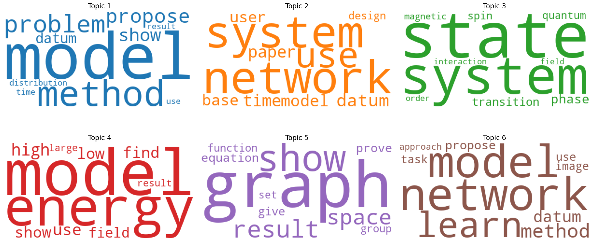
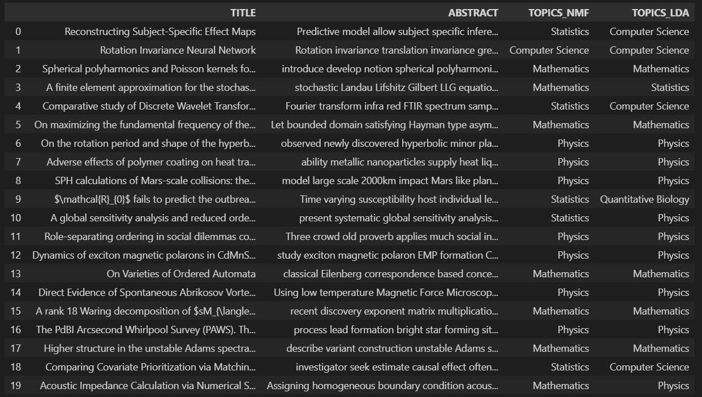
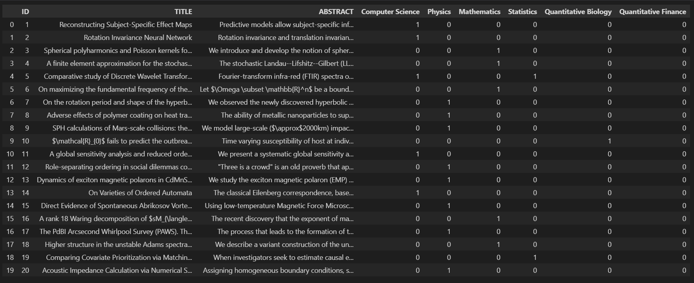
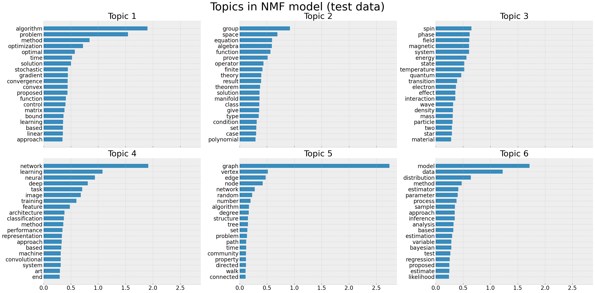
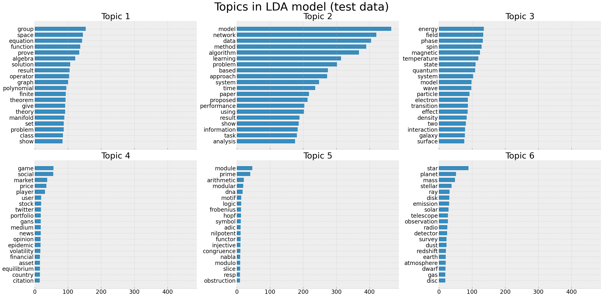
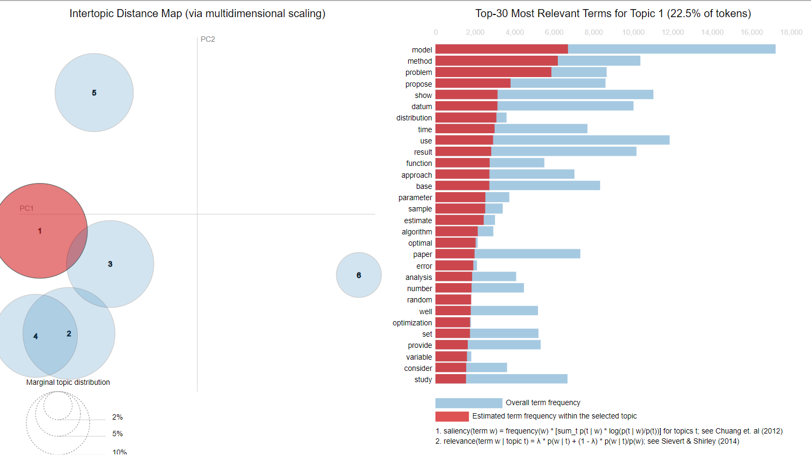

# Topic-Modeling

## Project aims/goals

In this project, Topic Modeling was used to classify research articles into different topics. The dataset was downloaded from Kaggle and uploaded by [Blesson Densil](https://www.kaggle.com/datasets/blessondensil294/topic-modeling-for-research-articles?resource=download). Fortunately, the zipped file dataset was already prepared in train and test splits. The train dataset contains 20972 rows, a title, an abstract column. It also contains the six ground truth topics represented by 1 if the article belongs under that topic and 0 if the article does not belong to that topic. The test data contains 8989 rows, the title and abstract columns only.

The aim of this project is to use topic modeling models in Scikit-Learn and Gensim libraries to classify the article abstracts into topics using the Non-negative Matrix Factorization (NMF) and the Latent Dirichlet Allocation (LDA) models. The results will then be compared with the ground truth models to determine which model is more fitting for this dataset. Both models will also be tested on new data that neither of the trained models haven't been exposed. The new data does not contain ground truth labels, so the topics will be solely reliant on the suggested keywords.

## Data Preprocessing

Using domain knowledge, I understand that there is a huge possibility that most of the ground truth topics are intertwined. This means many research articles are interdisciplinary and span more than one topic. For example, differential equations describing nonlinear waves can be a research in both Mathematics and Physics. Classification of the image of stars in the galaxy can be a research spanning both Physics and Computer Science. Given that the dataset contains scientific research articles, the articles contain some inline equations and equation environments prepared using the $\LaTeX$ typesetting software (specialized software for proper formatting of mathematical equations). Examples of such equations are $\omega$ and $$\mu_\Omega:=\max_{x}\lambda_1(\Omega\setminus(x+D)).$$These equations and Greek symbols were cleaned as part of the preprocessing steps. Punctuation marks, stop words were removed, lemmatization and tokenization were applied. Basically, the conventional NLP text preprocessing steps were applied to the dataset through a defined helper function.

An instance of the TFIDF vectorizer from the Scikit-Learn library was initiated and it was used to fit and transform the prepared corpus into inputs for the model to train on. The train dataset contains 9 columns but only the abstract column (`research_articles['ABSTRACT]`) was vectorized because it contained more information. All of these preprocessing steps were applied in the `topic_modeling.ipynb` file.

For the `topic_modeling_gensim.ipynb`, two preprocessing approaches were considered. For the first approach, the `preprocess_string` from the [Gensim library](https://radimrehurek.com/gensim/parsing/preprocessing.html) was used to remove punctuation, tags, numbers, multiple whitespaces and also stemmed the text. Although, this preprocessing resulted in a slightly higher coherence score (0.48 compared to 0.46), I preferred the second approach due to its extensiveness. For the second approach, the inline equations and equation environment were removed. The `simple_preprocess` from the [Gensim library](https://tedboy.github.io/nlps/generated/generated/gensim.utils.simple_preprocess.html) was also used to lowercase, tokenize, and de-accent the corpus. This returned a corpus which are final tokens unicode strings. Bigram and trigram models were built, helper functions to remove stopwords, make bigrams, trigrams and apply lemmatization to the entire corpus were defined and applied to the `research_articles['ABSTRACT]` column. A dictionary of the text corpus and bag of words were then created for inputs into the LDA model from the Gensim's library.

## Model selection and evaluation

This repo contains two Jupyter notebooks, the notebook named `topic_modeling.ipynb` is the one that will be explained first. That notebook contains the preprocessing steps and also the training of two models from the Scikit-Learn library. The Non-negative Matrix Factorization (NMF) and Latent Dirichlet Allocation (LDA) models were considered in that notebook. Those two models were considered because they are the most used Topic Modeling algorithms. After sequence of trainings, experimentations and iterations, the NMF model consistently did better than the LDA model because the suggested keywords from the NMF model were easy to pin to a topic compared to those from the LDA model. Although, it seems as if this is a great advantage for the NMF model. The ground truth remains that the research articles are not entirely independent/standalone. A research article can border around more than one topic. This means there is more hidden insights to the suggested keywords from the LDA model.

In the second notebook, named `topic_modeling_gensim.ipynb`, I further explored the LDA model by using the Gensim library implementation of the model. The rationale for doing this is that the Gensim's LDA algorithm implementation is more robust. There are also more algorithms for evaluating and visualizing the suggestions of this model compared to the Scikit-Learn library's implementation. An example of this rationale is provided below



PS... This is my point of view and it is limited to my current level of understanding of working on this project.

## Results

Using the suggested keywords from the two ML models, I tried to infer the topics. The dataframe containing the first 20 predictions is shown below


    
and the ground truth topics are presented below



Overall, both models seems to do a great job for the first 20 predictions as they were wrong for probably two or three times. Those predictions are from only the training data. It was quite difficult to make out some topics from the keywords probably due to the distribution of topics across the research articles. For the test data, these are the suggested keywords from the NMF model



and the suggested keywords from the LDA model are



Looking through more results from the `topic_modeling.ipynb` notebook, it will be observed that there seems to be a different distribution between the research topics in both the training and testing data. For the testing data, the LDA model was able to explicitly pick out topics directly related to Quantitative Finance, which was the first all through the modeling and evaluation process.

### Key takeaways

As stated before, the Gensim implementation of the LDA algorithm is quite robust. Through this implementation, I was able to validate my initial assumptions about the dataset. The pyLDAvis library graphically illustrates that there are interconnections between the research topics



The html file for the interactive form is presented in the outputs folder of this repo. The larger the circle, the more prevalent a topic is in the dataset; the smaller the circle, the less prevalent the topic is. This interactive display is for the training data.

## Challenges 
 - It was quite difficult to decide on the topics based on suggested keywords from the NMF and LDA models from Scikit-Learn's library. This was more difficult for the test dataset, which was supposed to be the evaluation for the two models' performance.

## Future Goals
- The Coherence score of the LDA model in the `topic_modeling_gensim.ipynb` notebook is quite low. Try out a more elaborate fine-tuning process for the model.

### Repo structure

```
├── README.md           <-- Markdown file explaining the project's 
|                              approach, methodology, and findings
│
├── train.csv           <-- Original dataset used in preprocessing and
|                             training the classification model.
|
├── test.csv           <-- Original dataset used for testing the trained 
|                           models.
│
├── topic_modeling.ipynb   <-- File containing code for training the NMF and 
|                                   LDA model from Scikit-Learn's library
|                  
│
├── topic_modeling_gensim.ipynb    <-- File containing code for training the 
|                                        LDA model from Gensim's library 
|                              
├── outputs              <-- Contains some saved figures from the modeling 
|                                process
|
```

### Tech stack

* `Pandas`, `NumPy` libraries for data analysis
* `WordCloud` library for visualizing most frequent words in corpus
* `NLTK` library for NLP preprocessing
* `Gensim`, `Spacy`, `re` libraries for natural language processing tasks
* `Scikit-Learn` library for model evaluation and performance review
* `Matplotlib` library for data visualizations
* `pyLDAvis` library for visualizing the suggested keywords from the Gensim LDA model

The inspiration for this project came after I completed the NLP - Natural Language Processing with Python at Udemy.

> CREDITS: Special appreciation goes out to the following individuals for their published articles on Topic Modeling
> - Selva Prabhakaran, [Topic Modeling with Gensim (Python)](https://www.machinelearningplus.com/nlp/topic-modeling-gensim-python/)
> - Shivam5992 Bansal, [Beginners Guide to Topic Modeling in Python](https://www.analyticsvidhya.com/blog/2016/08/beginners-guide-to-topic-modeling-in-python/)
> - Shashank Kapadia, [Topic Modeling in Python: Latent Dirichlet Allocation (LDA)](https://towardsdatascience.com/end-to-end-topic-modeling-in-python-latent-dirichlet-allocation-lda-35ce4ed6b3e0)
> - Ramya Vidiyala, [Topic Modelling on NYT articles using Gensim, LDA](https://towardsdatascience.com/topic-modelling-on-nyt-articles-using-gensim-lda-37caa2796cd9)